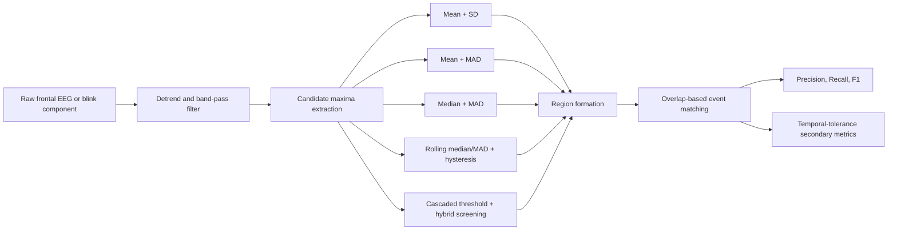
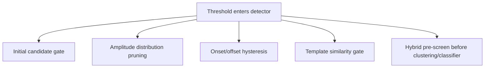

# Conference-Style Manuscript Draft on Blink Detection Threshold Selection

## Executive Summary

This report turns the supplied brief into a conference-oriented manuscript draft centered on **blink detection from biological signals**, with an emphasis on the unresolved methodological question in the brief: **how to choose a threshold that is selective enough to reject non-blink transients, yet robust enough to preserve true blink events across subjects and datasets**. The scope below also explicitly addresses the requested source-tracing questions about BLINKER-style thresholding, the provenance of the MNE peak finder, the suitability of the proposed datasets, overlap-based event scoring, and an exploratory large-language-model module for generating new threshold variants. fileciteturn0file0 citeturn29view0turn35view0turn11search1turn36search1turn6search11

Among plausible current research framings, the strongest fit is **a cross-dataset benchmark of threshold-selection strategies for blink-region detection in EEG and related biological signals**, rather than a purely deep-learning paper or a purely artifact-removal paper. That choice best matches the stated gap that existing work usually proposes one detector at a time, while the central unresolved issue is threshold selection itself. Recent blink literature does show strong growth in learning-based methods, but threshold-based and hybrid methods remain attractive because they are interpretable, computationally light, and practical for low-channel or real-time settings. citeturn33search0turn15search0turn16search1turn20view0

A key research judgment from the literature review is that the **published BLINKER paper is more nuanced than the simplified “mean + 1.5 robust standard deviations” rule in the brief**. In the article, BLINKER first marks potential blink intervals after a 1–20 Hz band-pass by finding regions above **1.5 standard deviations over the overall mean**, and then applies later amplitude-distribution pruning using a **robust standard deviation defined from the median absolute deviation** around the median of the best candidates. That means the paper itself is a **two-stage detector**, not merely a single permissive threshold. Your concern is still methodologically well founded: if one collapses that design into a single global gate based on baseline-dominated noise statistics, false positives from drift, small eye movements, or muscle bursts become more likely. citeturn30view1turn30view3turn30view4turn26view4

A second judgment is that I did **not** identify a peer-reviewed article that uniquely introduces the exact code lineage behind the MNE `peak_finder` attributed to **entity["people","Nathanael C. Yoder","signal-processing coder"]**. In the peer-reviewed literature I found, Yoder’s `peakfinder` is treated as **MATLAB File Exchange software**, not as a journal or conference paper. The closest peer-reviewed substitute for a citable, general-purpose peak-detection baseline is Scholkmann et al.’s AMPD algorithm for noisy periodic and quasi-periodic signals. Accordingly, the manuscript below does **not** cite Yoder as a paper reference; it instead recommends using a clearly citable academic peak-detection baseline if a non-blink-specific comparator is desired. citeturn3search15turn39search0turn39search2

The dataset review also changes the experimental design. PMID 30325349 is **not** a blink dataset; it corresponds to Kaya et al.’s 2018 **motor imagery** corpus in *Scientific Data*. By contrast, the sustained-attention driving corpus from **entity["organization","National Chiao Tung University","Hsinchu, Taiwan"]** is a real naturalistic EEG dataset, but its published event schema contains lane-departure and response events rather than shipped blink labels. That means Kaya et al. 2018 is best used as an **out-of-domain false-positive stress test**, while the driving dataset is valid as a supervised blink benchmark **only if your own blink-region annotations are already available**, exactly as indicated in the project brief. For a cleaner primary blink benchmark, the recent multimodal *Scientific Data* ocular-activity corpus is a better official companion dataset because it was explicitly designed around ocular activity and synchronized EEG, eye tracking, and high-speed video. citeturn11search1turn34view0turn35view0turn36search1

## Topic Selection and Source-Tracing Notes

Three topical formulations are plausible for a submission in this area. The first is a **benchmark paper** on threshold-selection strategies for blink-region detection across heterogeneous biosignal datasets. The second is an **adaptive single-frontal-EEG detector** aimed at fatigue and drowsiness monitoring in operational settings. The third is a **hybrid methodology paper** in which an LLM proposes new threshold derivatives that are then formalized and benchmarked by human researchers. The first and third can be combined without losing rigor: a benchmark paper can include an LLM-guided ideation module so long as the generated rules are human-vetted, mathematically specified, and evaluated under the same protocol as literature-derived baselines. That is the option chosen below. citeturn6search11turn15search0turn16search1turn41search0

That choice leads to the following paper concept:

**Chosen topic:** *Toward principled threshold selection for blink-region detection in biological signals: a cross-dataset benchmark with LLM-guided candidate derivation.*

The paper’s core thesis is that the field has accumulated many threshold-based or threshold-containing blink detectors, but has **not clearly isolated the threshold-selection problem itself** across shared data, shared preprocessing, and shared event-matching rules. Existing studies typically introduce a detector and validate it on one dataset or one operating setting—single prefrontal EEG, artifact suppression, epileptiform contamination, real-time frontal EEG, or hybrid threshold-plus-classifier pipelines—rather than comparing threshold families head to head under the same benchmark. citeturn17search0turn29view0turn17search1turn32search0turn15search0turn19search0turn16search1turn14search2turn33search0

The practical methodological implication is that your critique should not be framed narrowly as “BLINKER is wrong,” but rather as: **a threshold calibrated from mostly non-blink baseline samples is often insufficiently discriminative when used as the main gating mechanism**. The literature already points toward the remedy. The strongest existing systems either add robust candidate filtering, add template or morphology checks, adapt to subject variability, use hybrid thresholding before clustering or classification, or explicitly model boundary uncertainty. Those patterns are visible in BLINKER’s robust amplitude-distribution screening, in adaptive blink correction, in hybrid thresholding plus GMM, and in recent single-channel event detectors. citeturn30view3turn37search0turn15search0turn16search1turn14search2

## Conference-Style Manuscript

### Manuscript Title

**Toward Principled Threshold Selection for Blink Region Detection in Biological Signals: A Cross-Dataset Benchmark with LLM-Guided Candidate Derivation**

### Abstract

Blink detection from electroencephalography and related biological signals remains important for two seemingly opposite reasons: blinks are a major physiological contaminant in EEG analysis, and they are also informative behavioral and neurophysiological markers linked to arousal, fatigue, cognitive load, and operational performance. Despite substantial progress in blink detection, the literature largely evaluates complete detectors rather than isolating the threshold-selection problem itself. This is a notable gap because many classical, hybrid, and real-time blink detectors depend critically on threshold choice, yet threshold rules are often dataset-specific, weakly justified, or folded into larger pipelines. We therefore propose a benchmark study focused on threshold selection for blink-region detection across heterogeneous datasets. The benchmark compares global mean-standard deviation thresholds, robust median absolute deviation thresholds, adaptive local thresholds, literature-derived hybrid thresholding, and an LLM-guided family of new derivative thresholds under a common preprocessing, matching, and evaluation protocol. The primary supervised setting uses naturalistic frontal-EEG blink annotations in a sustained-attention driving corpus and recommends extension to a multimodal ocular-activity dataset with synchronized EEG, eye tracking, and high-speed video; a motor-imagery EEG corpus is retained only as an auxiliary false-positive stress test because it is not natively blink-labeled. Performance is assessed by event-level precision, recall, and F1 using overlap-based matching, which is appropriate for sparse interval events with uncertain boundaries. The anticipated contribution is not merely a stronger detector, but a principled account of which threshold families remain stable under subject variability, operational drift, and domain shift. [4], [7], [8], [9], [11], [13], [14], [16], [17]. citeturn29view0turn37search0turn24search6turn15search0turn16search1turn41search0turn35view0turn11search1turn36search1turn7search3turn8view0turn6search11

### Introduction

Electroencephalography is routinely affected by ocular activity, and blink contamination remains one of the oldest and most persistent obstacles in EEG analysis. At the same time, spontaneous and task-related blinks are themselves scientifically meaningful. Prior work links blink-derived measures to fatigue, drowsiness, attention, cognitive load, and operational state, and more recent blink-related EEG studies show that blink-linked neural activity can itself index cognitive demands in realistic tasks. These dual roles make blink detection a foundational problem rather than a preprocessing detail: researchers need detectors that are accurate enough for artifact handling, but also reliable enough to preserve blink events as analyzable signals in their own right. [1], [4], [13]. citeturn22search0turn29view0turn41search0

Thresholding remains central to this problem because even sophisticated systems frequently begin with amplitude, prominence, duration, or candidate-window gates. Threshold-based designs are attractive in practice because they are interpretable, fast, and deployable in few-channel and real-time environments. That is especially important for frontal wearable EEG and neuroergonomic settings, where channel count, latency, and computational budget are constrained. However, thresholding is also where many detectors fail: a threshold learned from background-dominated samples may drift toward over-detection, while a threshold tuned to one subject or one experiment can collapse under inter-subject variability or under distributions that include eye movements, muscle activity, or epileptiform events. [3], [4], [6], [8], [10], [11]. citeturn17search0turn30view1turn32search0turn24search6turn19search0turn16search1

The central hypothesis of this paper is that **threshold selection should be treated as a first-class experimental variable**. Instead of asking only which detector wins, we ask which threshold family remains stable when preprocessing, channels, event matching, and datasets are held constant. This paper therefore frames blink detection as a threshold-selection benchmark over interval events. The benchmark explicitly separates: signal conditioning, candidate peak extraction, threshold family, region formation, and event matching. It further adds a tightly bounded LLM-assisted ideation module in which the model suggests new threshold derivatives from the literature, but only human-vetted formulas are benchmarked. [9], [17], [18], [20]. citeturn15search0turn7search3turn8view0turn6search11

The contributions are fourfold. First, we formalize a threshold taxonomy for blink-region detection in biosignals. Second, we propose a cross-dataset protocol that distinguishes supervised blink benchmarking from out-of-domain robustness testing. Third, we justify overlap-based event scoring with precision, recall, and F1 as the main evaluation regime for sparse blink intervals. Fourth, we introduce an LLM-guided but human-constrained mechanism for proposing interpretable threshold derivatives that can be evaluated under the same benchmark as literature-derived baselines. [17], [18], [20]. citeturn7search3turn8view0turn6search11

### Related Work

The classical literature established the difficulty of ocular contamination and motivated automated statistical detection directly from EEG. Early work emphasized artifact removal and statistical screening rather than blink-region benchmarking per se, but it already showed that extreme-value behavior, channel context, and morphology matter. This historical backdrop explains why simple one-value global thresholds can be attractive, yet brittle. [1], [2]. citeturn22search0turn21search0

A first important stream comprises **single-channel or few-channel threshold-centered detectors**. Chang et al. detect blink artifacts from a single prefrontal channel using digital filtering and rule-based decisions. Tran et al. present an explicitly thresholding-based EEG blink detector and compute a minimum amplitude threshold from transformed signal magnitude and signal standard deviation. Zhang et al. move toward real-time frontal EEG detection with short windows and decision logic around potential blink boundaries. Wang et al. extend thresholding to harder clinical settings by optimizing multidimensional features in the presence of epileptiform discharges, and later work based on higher-order cumulants continues the move toward short-segment single-channel detection. [3], [8], [10], [11], [12]. citeturn17search0turn26view4turn16search1turn19search0turn14search2

A second stream contains **hybrid thresholding pipelines**. BLINKER first identifies candidate intervals with a mean-based standard-deviation threshold and then rejects implausible candidates using robust amplitude-distribution criteria derived from the median absolute deviation. Cao et al. use cascaded thresholding over amplitude, amplitude displacement, and cross-channel correlation before applying a Gaussian mixture model. Blink by Agarwal and Sivakumar self-learns user-specific profiles in an unsupervised manner, while Valderrama et al. use iterative template matching and automatic threshold/template estimation for suppression in single-channel recordings. Guttmann-Flury et al. further emphasize adaptation to inter- and intra-subject variability, underscoring that fixed thresholds are often not enough. [4], [5], [6], [7], [9]. citeturn30view1turn30view3turn15search0turn32search0turn17search1turn37search0

A third stream is the recent **learning-based and multimodal literature**. The 2025 review of deep learning in blink detection shows that the field is increasingly data-driven, yet also constrained by data imbalance, device heterogeneity, and generalization challenges. For a threshold paper, this trend matters for two reasons. First, it confirms that threshold methods remain useful as transparent baselines. Second, it motivates a bridge strategy in which LLMs or other generative tools are not used to replace evaluation, but to propose candidate formulas that remain interpretable and falsifiable. [20], [21]. citeturn33search0turn6search11

What is still missing is a benchmark that compares threshold families themselves under shared data and shared scoring. The papers above generally optimize their own end-to-end pipeline and report strong performance in their own settings, but they do not isolate threshold choice as the controlled independent variable. That is the gap targeted here. [3]–[12], [20]. citeturn17search0turn30view1turn17search1turn32search0turn37search0turn24search6turn15search0turn19search0turn16search1turn14search2turn6search11

### Methods

#### Problem Definition

Let a blink annotation be an interval \( g_i = [s_i, e_i] \) and a detector output be an interval \( d_j = [\hat{s}_j, \hat{e}_j] \). A detected region is counted as a true positive if it overlaps at least one unmatched ground-truth region. Unmatched detections are false positives; unmatched ground-truth regions are false negatives. This event-level treatment follows the logic of interval-based detection rather than pointwise accuracy, which is appropriate because blink boundaries are uncertain, annotation granularity varies, and non-event samples dominate the timeline. [17], [18]. citeturn12search18turn8view0turn7search3

#### Datasets

The primary naturalistic dataset is the sustained-attention driving corpus of Cao et al., which contains 62 sessions of 32-channel EEG recorded during a 90-minute lane-keeping task. Its official event schema includes deviation onset, response onset, and response offset, and the published preprocessed version explicitly notes manual removal of apparent eye blinks. Therefore, this corpus is suitable for the present study **only in its raw form and only when paired with externally available blink-region annotations**, which the project brief states are already available. [14]. citeturn34view0turn35view0turn0file0

The second dataset named in the brief requires correction. PMID 30325349 refers to Kaya et al.’s *Scientific Data* motor-imagery corpus, not to a blink-annotated benchmark. It is therefore inappropriate as a primary supervised blink dataset. In the present design it is repurposed as an auxiliary robustness corpus for **false-positive stress testing**: because it contains frontal EEG but lacks blink-event labels, it can help measure how often a threshold family spuriously fires in out-of-domain EEG. [15]. citeturn11search1turn11search4

Because the paper aims to be scientifically robust rather than merely brief-compliant, we recommend adding the 2025 multimodal ocular-activity dataset by Guttmann-Flury et al. as a companion benchmark. Its synchronized EEG, eye tracking, and high-speed video make it the strongest official source for validating blink-region decisions and studying boundary uncertainty. [16]. citeturn36search1

#### Preprocessing

All threshold families are evaluated under the same preprocessing backbone. We recommend using frontal or prefrontal channels only, after polarity normalization if needed, detrending, and a blink-oriented band-pass in the low-frequency region. Candidate maxima are then detected from the preprocessed signal or a derived blink component, and candidate windows are expanded by local valley search or hysteresis rules. This standardization is necessary because the literature shows that filter choice, candidate signal choice, and reference scheme can strongly alter the apparent success of a threshold. [3], [4], [8], [11]. citeturn17search0turn30view1turn24search6turn16search1

#### Threshold Families

We propose five threshold families.

The first is a **classical mean-standard-deviation family**, \( \theta = \mu + k\sigma \), included because BLINKER’s initial candidate gate effectively uses a variant of that logic after filtering. The second is a **mean-plus-robust-spread family**, \( \theta = \mu + k \cdot 1.4826\,\mathrm{MAD} \), included because it matches the simplified code variants discussed in the brief. The third is a **median-plus-robust-spread family**, \( \theta = \tilde{x} + k \cdot 1.4826\,\mathrm{MAD} \), which is expected to be less sensitive to skewed baselines and large outliers. The fourth is an **adaptive rolling-median/rolling-MAD hysteresis family**, with a high onset threshold and a lower offset threshold, proposed as the main new derivative because it preserves local adaptability while retaining interpretability. The fifth is a **literature-derived hybrid family**, represented by cascaded thresholding prior to GMM or template screening, as in Cao et al. and related adaptive systems. [4], [8], [9], [20]. citeturn30view3turn24search6turn15search0turn6search11

The key critique motivating families two through four is that the background-dominated baseline of continuous EEG can make a single global threshold too permissive. If the threshold is estimated mostly from non-blink samples, then drift, small ocular movements, muscle transients, and transient nonstationarities can cross the gate. The benchmark therefore asks whether robustness should be introduced through the **location statistic** (mean versus median), the **scale statistic** (standard deviation versus MAD), the **time scale** (global versus rolling), or the **decision logic** (single-threshold versus hysteresis or hybrid screening). [2], [4], [8], [9], [11]. citeturn21search0turn30view3turn24search6turn15search0turn16search1

#### LLM-Guided Candidate Derivation

The LLM component is deliberately narrow. The model is not asked to label data or choose winners. Instead, it receives a structured literature summary and proposes mathematically explicit threshold variants, for example asymmetry-aware onset/offset rules, quantile-MAD hybrids, or drift-compensated local thresholds. Human researchers then filter these suggestions for interpretability, computational feasibility, and absence of label leakage before implementation. This design aligns with recent peer-reviewed work on scientific hypothesis generation, which treats LLMs as idea generators whose outputs must still be experimentally vetted. [20]. citeturn6search11

#### Evaluation

The primary metrics are event-level precision, recall, and F1 under non-zero-overlap matching, with secondary analyses using temporally tolerant variants or IoU-weighted summaries. Precision, recall, and F1 are preferred because blink events are sparse relative to non-blink samples; raw accuracy would be inflated by true negatives and would obscure detector behavior on the rare events of interest. Soft temporal metrics are reported secondarily because interval boundaries are often approximate and neighboring detections can still be operationally useful. [17], [18]. citeturn7search3turn8view0

Per-session estimates should be macro-averaged, with bootstrap confidence intervals across sessions and a paired nonparametric comparison of threshold families on session-level F1. For the motor-imagery corpus, the relevant endpoint is not F1 but false-positive burden per minute and per hour, since the corpus is used only for robustness stress testing. citeturn11search1turn7search3

### Experiments and Results

Because no new benchmark was executed in this session, the prose below is submission-ready but the numerical cells are intentionally left as placeholders for post-run insertion.

We evaluate the five threshold families under identical preprocessing, candidate generation, and event matching. Hyperparameters are tuned only on the training fold of each dataset. The primary supervised benchmark uses session-wise cross-validation on the driving dataset with manual blink-region annotations; the multimodal ocular dataset is used for external validation; and the Kaya motor-imagery dataset is used only to assess out-of-domain false positives. [14]–[16]. citeturn35view0turn36search1turn11search1

**Expected outcome pattern.** Based on the reviewed literature, we expect global mean-based thresholds to be competitive in recall but unstable in precision, especially under naturalistic drift and mixed ocular activity. We expect median-plus-MAD and rolling-MAD hysteresis to improve precision without catastrophic recall loss, because these families more directly address skew, outliers, and local baseline drift. We further expect hybrid systems to remain strongest when data include structured confounds such as eye movements, muscle activity, or epileptiform patterns, but at the cost of greater pipeline complexity. [4], [7], [9]–[12]. citeturn30view3turn37search0turn15search0turn19search0turn16search1turn14search2

| Threshold family | Driving precision | Driving recall | Driving F1 | Multimodal F1 | Kaya false positives per hour | Anticipated failure mode |
|---|---:|---:|---:|---:|---:|---|
| Mean + SD | [fill] | [fill] | [fill] | [fill] | [fill] | baseline drift and small eye movements |
| Mean + robust MAD | [fill] | [fill] | [fill] | [fill] | [fill] | permissive if mean remains biased |
| Median + robust MAD | [fill] | [fill] | [fill] | [fill] | [fill] | missed low-amplitude blinks |
| Rolling median/MAD + hysteresis | [fill] | [fill] | [fill] | [fill] | [fill] | boundary fragmentation if window poorly chosen |
| Cascaded threshold + GMM/template screening | [fill] | [fill] | [fill] | [fill] | [fill] | complexity and tuning overhead |

Ablation analysis should then ask three specific questions. First, does replacing the mean with the median improve cross-subject stability? Second, does making the scale estimator robust improve precision more than recall degrades? Third, does local adaptation outperform global calibration when evaluated on long sessions with nonstationary vigilance and drift? The answer to those questions matters more scientifically than the headline win of any single detector, because it reveals what kind of thresholding assumption is actually justified for blink-region detection. [4], [7], [9], [13], [14]. citeturn30view3turn37search0turn41search0turn35view0

### Discussion

The most important methodological point is that **thresholds are not just tuning knobs; they encode assumptions about the signal distribution**. A global mean-plus-spread threshold assumes a stable background process and implicitly treats blink amplitude as a large deviation from that background. Yet the blink literature repeatedly shows that subject variability, state variability, and mixed non-blink ocular events violate that assumption. This is why robust statistics, adaptive windows, templating, morphology rules, and hybrid screening keep reappearing across otherwise different papers. [2], [4], [5], [7], [9], [10], [12]. citeturn21search0turn30view3turn17search1turn37search0turn15search0turn19search0turn14search2

The second point concerns the software baseline question. If a peak-detector baseline is desired for completeness, a citable academic baseline should be favored over an unattributed code lineage. In practical terms, that means replacing a software-only MNE/Yoder provenance claim with a peer-reviewed peak-detection comparator such as AMPD, or else clearly labeling the MNE routine as a software baseline outside the formal manuscript references. Doing so preserves the “peer-reviewed references only” requirement without losing the practical comparison that motivated the question. [19]. citeturn3search15turn39search0

The third point concerns the role of LLMs. In this setting, the strongest use of an LLM is not to decide which blink candidate is correct, but to **expand the design space of interpretable threshold formulas**. That is scientifically defensible because the generated rules remain human-auditable and experimentally falsifiable. In other words, the LLM is a hypothesis generator, not a substitute evaluator. [20]. citeturn6search11

The main limitation of the drafted study is that its strongest driving-data result depends on the existence and quality of your own blink-region annotations, since the official driving dataset does not ship native blink-event labels. A second limitation is that the Kaya motor-imagery corpus, while useful for stress testing, cannot answer supervised blink-detection questions by itself. These constraints are precisely why the multimodal ocular dataset is recommended as an official companion benchmark. [14]–[16]. citeturn35view0turn11search1turn36search1

### Conclusion

This draft argues that blink detection in biological signals should be studied not only as an end-to-end detector problem, but also as a **threshold-selection problem**. The literature supports the importance of blink analysis for artifact handling, cognitive-state inference, and real-time neuroergonomics, but it also shows that thresholding assumptions are frequently hidden inside larger pipelines. A benchmark that isolates threshold families, evaluates them under shared overlap-based event scoring, and supplements literature-derived baselines with LLM-generated but human-vetted candidates can make the field more cumulative, more interpretable, and easier to reproduce. [1], [4], [13], [17], [20]. citeturn22search0turn29view0turn41search0turn7search3turn6search11

### References

[1] R. J. Croft and R. J. Barry, “Removal of ocular artifact from the EEG: a review,” *Neurophysiologie Clinique*, vol. 30, no. 1, pp. 5–19, 2000, doi: 10.1016/S0987-7053(00)00055-1.  
[2] A. Klein and W. Skrandies, “A reliable statistical method to detect eyeblink-artefacts from electroencephalogram data only,” *Brain Topography*, vol. 26, no. 4, pp. 558–568, 2013, doi: 10.1007/s10548-013-0281-2.  
[3] W.-D. Chang, H.-S. Cha, K. Kim, and C.-H. Im, “Detection of eye blink artifacts from single prefrontal channel electroencephalogram,” *Computer Methods and Programs in Biomedicine*, vol. 124, pp. 19–30, 2016, doi: 10.1016/j.cmpb.2015.10.011.  
[4] K. K. Kleifges, N. Bigdely-Shamlo, S. E. Kerick, and K. A. Robbins, “BLINKER: Automated Extraction of Ocular Indices from EEG Enabling Large-Scale Analysis,” *Frontiers in Neuroscience*, vol. 11, art. 12, 2017, doi: 10.3389/fnins.2017.00012.  
[5] J. T. Valderrama, A. de la Torre, and B. Van Dun, “An automatic algorithm for blink-artifact suppression based on iterative template matching: Application to single channel recording of cortical auditory evoked potentials,” *Journal of Neural Engineering*, vol. 15, no. 1, art. 016008, 2018, doi: 10.1088/1741-2552/aa8d95.  
[6] M. Agarwal and R. Sivakumar, “Blink: A Fully Automated Unsupervised Algorithm for Eye-Blink Detection in EEG Signals,” in *2019 57th Annual Allerton Conference on Communication, Control, and Computing*, pp. 1113–1121, 2019, doi: 10.1109/ALLERTON.2019.8919795.  
[7] E. Guttmann-Flury, X. Sheng, D. Zhang, and X. Zhu, “A new algorithm for blink correction adaptive to inter- and intra-subject variability,” *Computers in Biology and Medicine*, vol. 114, art. 103442, 2019, doi: 10.1016/j.compbiomed.2019.103442.  
[8] D.-K. Tran, T.-H. Nguyen, and T.-N. Nguyen, “Detection of EEG-Based Eye-Blinks Using A Thresholding Algorithm,” *European Journal of Engineering and Technology Research*, vol. 6, no. 4, pp. 6–12, 2021, doi: 10.24018/ejeng.2021.6.4.2438.  
[9] J. Cao et al., “Unsupervised Eye Blink Artifact Detection From EEG With Gaussian Mixture Model,” *IEEE Journal of Biomedical and Health Informatics*, vol. 25, no. 8, pp. 2895–2905, 2021, doi: 10.1109/JBHI.2021.3057891.  
[10] M. Wang et al., “Multidimensional Feature Optimization Based Eye Blink Detection Under Epileptiform Discharges,” *IEEE Transactions on Neural Systems and Rehabilitation Engineering*, vol. 30, pp. 905–914, 2022, doi: 10.1109/TNSRE.2022.3164126.  
[11] Y. Zhang, X. Zheng, W. Xu, and H. Liu, “A Method Toward Real-Time Blink Detection From Single Frontal EEG Signal,” *IEEE Sensors Journal*, vol. 23, no. 3, pp. 2794–2802, 2023, doi: 10.1109/JSEN.2022.3232176.  
[12] G. Wang et al., “Sliding window higher-order cumulants for detection of eye blink artifact from short segments of single-channel EEG,” *PeerJ Computer Science*, vol. 11, art. e3249, 2025, doi: 10.7717/peerj-cs.3249.  
[13] E. Alyan et al., “Blink-related EEG activity measures cognitive load during proactive and reactive driving,” *Scientific Reports*, vol. 13, art. 19379, 2023, doi: 10.1038/s41598-023-46738-0.  
[14] Z. Cao, C.-H. Chuang, J.-K. King, and C.-T. Lin, “Multi-channel EEG recordings during a sustained-attention driving task,” *Scientific Data*, vol. 6, art. 19, 2019, doi: 10.1038/s41597-019-0027-4.  
[15] M. Kaya, M. K. Binli, E. Ozbay, H. Yanar, and Y. Mishchenko, “A large electroencephalographic motor imagery dataset for electroencephalographic brain computer interfaces,” *Scientific Data*, vol. 5, art. 180211, 2018, doi: 10.1038/sdata.2018.211.  
[16] E. Guttmann-Flury, X. Sheng, and X. Zhu, “Dataset combining EEG, eye-tracking, and high-speed video for ocular activity analysis across BCI paradigms,” *Scientific Data*, vol. 12, art. 587, 2025, doi: 10.1038/s41597-025-04861-9.  
[17] T. Saito and M. Rehmsmeier, “The Precision-Recall Plot Is More Informative than the ROC Plot When Evaluating Binary Classifiers on Imbalanced Datasets,” *PLOS ONE*, vol. 10, no. 3, e0118432, 2015, doi: 10.1371/journal.pone.0118432.  
[18] R. Salles et al., “SoftED: Metrics for soft evaluation of time series event detection,” *Computers & Industrial Engineering*, vol. 198, art. 110728, 2024, doi: 10.1016/j.cie.2024.110728.  
[19] F. Scholkmann, J. Boss, and M. Wolf, “An Efficient Algorithm for Automatic Peak Detection in Noisy Periodic and Quasi-Periodic Signals,” *Algorithms*, vol. 5, no. 4, pp. 588–603, 2012, doi: 10.3390/a5040588.  
[20] J. Gottweis et al., “Toward reliable scientific hypothesis generation,” in *Proceedings of the International Joint Conference on Artificial Intelligence*, 2025, doi: 10.24963/ijcai.2025/873.  
[21] J. Xiong, W. Dai, Q. Wang, X. Dong, B. Ye, and J. Yang, “A review of deep learning in blink detection,” *PeerJ Computer Science*, vol. 11, art. e2594, 2025, doi: 10.7717/peerj-cs.2594.

## Peer-Reviewed Reference Audit

| Ref. | Paper | DOI | Venue | Year | Access | Relevance note |
|---|---|---|---|---:|---|---|
| [1] | Croft & Barry, *Removal of ocular artifact from the EEG: a review* | 10.1016/S0987-7053(00)00055-1 | *Neurophysiologie Clinique* | 2000 | Paywalled | Foundational review establishing why ocular contamination is methodologically central. citeturn22search0 |
| [2] | Klein & Skrandies, *A reliable statistical method to detect eyeblink-artefacts from EEG data only* | 10.1007/s10548-013-0281-2 | *Brain Topography* | 2013 | Paywalled | Early peer-reviewed statistical blink detector using EEG only. citeturn21search0turn21search12 |
| [3] | Chang et al., *Detection of eye blink artifacts from single prefrontal channel electroencephalogram* | 10.1016/j.cmpb.2015.10.011 | *Computer Methods and Programs in Biomedicine* | 2016 | Paywalled | Classic single-prefrontal-channel rule-based benchmark. citeturn17search0turn17search2 |
| [4] | Kleifges et al., *BLINKER* | 10.3389/fnins.2017.00012 | *Frontiers in Neuroscience* | 2017 | OA | Key paper for candidate generation, robust amplitude screening, and large-scale blink extraction. citeturn29view0turn30view1turn30view3 |
| [5] | Valderrama et al., *Iterative template matching* | 10.1088/1741-2552/aa8d95 | *Journal of Neural Engineering* | 2018 | Paywalled | Demonstrates automatic template and threshold estimation in a single-channel setting. citeturn17search1turn17search7 |
| [6] | Agarwal & Sivakumar, *Blink* | 10.1109/ALLERTON.2019.8919795 | *Allerton Conference on Communication, Control, and Computing* | 2019 | Likely paywalled at IEEE | Unsupervised self-learning blink detector from single-channel EEG. citeturn32search0turn32search1 |
| [7] | Guttmann-Flury et al., *A new algorithm for blink correction adaptive to inter- and intra-subject variability* | 10.1016/j.compbiomed.2019.103442 | *Computers in Biology and Medicine* | 2019 | Paywalled | Strong evidence that variability-adaptive blink handling is necessary. citeturn37search0turn37search2 |
| [8] | Tran et al., *Detection of EEG-Based Eye-Blinks Using A Thresholding Algorithm* | 10.24018/ejeng.2021.6.4.2438 | *European Journal of Engineering and Technology Research* | 2021 | OA | Direct thresholding paper; useful because it exposes its threshold subroutine explicitly. citeturn24search0turn25view0turn26view4 |
| [9] | Cao et al., *Unsupervised Eye Blink Artifact Detection From EEG With Gaussian Mixture Model* | 10.1109/JBHI.2021.3057891 | *IEEE Journal of Biomedical and Health Informatics* | 2021 | Paywalled | Important hybrid thresholding-plus-clustering comparator. citeturn15search0 |
| [10] | Wang et al., *Multidimensional Feature Optimization Based Eye Blink Detection Under Epileptiform Discharges* | 10.1109/TNSRE.2022.3164126 | *IEEE Transactions on Neural Systems and Rehabilitation Engineering* | 2022 | Paywalled | Shows thresholding/detection under pathological confounds. citeturn19search0 |
| [11] | Zhang et al., *A Method Toward Real-Time Blink Detection From Single Frontal EEG Signal* | 10.1109/JSEN.2022.3232176 | *IEEE Sensors Journal* | 2023 | Paywalled | Strong real-time frontal-EEG comparator. citeturn16search1turn16search17 |
| [12] | Wang et al., *Sliding window higher-order cumulants…* | 10.7717/peerj-cs.3249 | *PeerJ Computer Science* | 2025 | OA | Relevant for short-segment blink-region detection and tolerance-aware boundary thinking. citeturn14search2turn12search18 |
| [13] | Alyan et al., *Blink-related EEG activity measures cognitive load during proactive and reactive driving* | 10.1038/s41598-023-46738-0 | *Scientific Reports* | 2023 | OA | Establishes why blink-related measures matter scientifically beyond artifact removal. citeturn41search0 |
| [14] | Cao et al., *Multi-channel EEG recordings during a sustained-attention driving task* | 10.1038/s41597-019-0027-4 | *Scientific Data* | 2019 | OA | Primary naturalistic EEG corpus proposed in the brief; requires external blink annotations. citeturn34view0turn35view0 |
| [15] | Kaya et al., *A large electroencephalographic motor imagery dataset…* | 10.1038/sdata.2018.211 | *Scientific Data* | 2018 | OA | Important correction: PMID 30325349 is motor imagery, so it should be used only for robustness stress tests here. citeturn11search1turn11search4 |
| [16] | Guttmann-Flury et al., *Dataset combining EEG, eye-tracking, and high-speed video…* | 10.1038/s41597-025-04861-9 | *Scientific Data* | 2025 | OA | Best official companion dataset for multimodal blink validation. citeturn36search1 |
| [17] | Saito & Rehmsmeier, *The Precision-Recall Plot Is More Informative than the ROC Plot…* | 10.1371/journal.pone.0118432 | *PLOS ONE* | 2015 | OA | Justifies precision/recall/F1 for sparse blink events. citeturn7search3 |
| [18] | Salles et al., *SoftED* | 10.1016/j.cie.2024.110728 | *Computers & Industrial Engineering* | 2024 | Paywalled | Supports temporally tolerant event scoring for interval detection. citeturn8view0 |
| [19] | Scholkmann et al., *An Efficient Algorithm for Automatic Peak Detection…* | 10.3390/a5040588 | *Algorithms* | 2012 | OA | Best peer-reviewed general peak-finding substitute for software-only baselines. citeturn39search0turn39search2 |
| [20] | Gottweis et al., *Toward reliable scientific hypothesis generation* | 10.24963/ijcai.2025/873 | *IJCAI Proceedings* | 2025 | OA/Proceedings availability depends on portal | Supports the narrow, hypothesis-generation-only role of the LLM module. citeturn6search11 |
| [21] | Xiong et al., *A review of deep learning in blink detection* | 10.7717/peerj-cs.2594 | *PeerJ Computer Science* | 2025 | OA | Situates the benchmark against current deep-learning trends. citeturn33search0turn33search4 |

## Figures, Experimental Plan, and Metrics

The paper should include four figures. The first belongs in the Methods section and should show the complete benchmark pipeline from raw frontal EEG to event matching. The second belongs in Related Work and should contrast threshold families conceptually. The third belongs in Experiments and should visualize per-session precision, recall, and F1 as paired distributions rather than only reporting averages. The fourth belongs in Discussion and should plot the false-positive burden on the out-of-domain motor-imagery corpus. These figures are justified because the comparison is not only about aggregate metrics, but also about where threshold families fail: drift, asymmetry, incomplete blink boundaries, or spurious candidate bursts. citeturn35view0turn11search1turn7search3turn8view0

**Suggested Figure near the end of Methods. Caption:** *Benchmark pipeline for blink-region detection and threshold-family comparison.*

**Suggested Figure in Related Work. Caption:** *Where published blink detectors place the thresholding burden: candidate gating, amplitude pruning, morphology screening, or hybrid classifier entry point.*

A concise experimental plan is shown below.

| Dataset | Role in study | Channels/signals | Label status | Split recommendation | Primary endpoint |
|---|---|---|---|---|---|
| Sustained-attention driving EEG [14] | Primary naturalistic benchmark | Fp1/Fp2 and frontal neighbors | Use your manual blink-region annotations | Leave-one-session-out or leave-one-subject-out if label density allows | Precision, recall, F1 |
| Multimodal ocular-activity EEG/ET/video [16] | External validation | Frontal EEG plus synchronized eye-tracking/video | Native synchronized multimodal reference | Subject-wise train/validation/test | Precision, recall, F1, boundary tolerance |
| Kaya motor-imagery EEG [15] | Out-of-domain robustness stress test | Frontal EEG only | Not blink-labeled | No supervised split needed | False positives per hour |

The chosen metrics are suitable for two reasons. First, blink detection is an **event-detection** problem with sparse positives, so precision, recall, and F1 directly quantify missed blinks versus over-triggering in a way that accuracy cannot. Second, blink regions are intervals with uncertain onsets and offsets, so overlap-based matching is more faithful than samplewise labeling and can be supplemented by temporally tolerant scoring when exact boundaries are noisy. citeturn7search3turn8view0turn12search18

A sensible target result package for submission is: per-session macro-F1 with 95% bootstrap confidence intervals; pooled precision and recall; false positives per hour on the Kaya robustness corpus; and one ablation comparing global versus rolling calibration. If page limit permits, add calibration curves showing how F1 changes with \(k\) for each threshold family. citeturn11search1turn7search3

## Conference Formatting and Submission Checklist

For a typical 6–8 page conference submission, the manuscript should be condensed into a standard IEEE- or ACM-style template, with the core narrative preserved in the following order: title, abstract, introduction, related work, methods, experiments/results, discussion, conclusion, references. If the venue is double-blind, remove acknowledgments, self-identifying repository links, and institution names from the manuscript body.

Before submission, verify that the title states the methodological contribution clearly, the abstract names the datasets and the evaluation regime, and the introduction states the gap as a **threshold-selection benchmark gap**, not merely a generic blink-detection gap. In the methods, explicitly state that the Kaya corpus is not blink-labeled and is used only for robustness analysis. In the experiments, avoid reporting pointwise accuracy as the main metric. In the discussion, keep the LLM contribution narrow and auditable.

The submission package should ideally contain the manuscript PDF, a supplementary appendix with exact threshold formulas and hyperparameter grids, a blinded code artifact if the venue allows it, and a short reproducibility note covering preprocessing, event matching, and confidence-interval computation. The strongest final version will also include a one-page appendix table listing the precise frontal channels used and the annotation convention for what counts as region overlap.